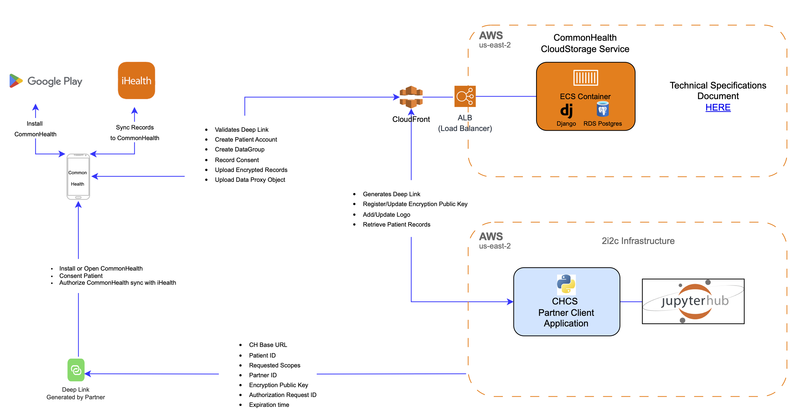

# Introduction
The JupyterHealth Pre-MVP security focuses on establishing a secure privacy perserving transmission of patient data from:

```mermaid
flowchart LR
  A[Medical Device API] --> B
  B[CommonHealth Application] --> C
  C[CloudStorage Service] --> D
  D[Partner Data Store]
```

# API Credentials
- CommonHealth Application will authenticate with the Medical Device API using:
    - Client ID
    - Client Secret
- Each Partner will authenticate with the CloudStorage Service using:
    - Partner ID
    - Client ID
    - Client Secret

# Encryption
- Each Partner will generate a set of Private/Public keys that will used for encryption and decryption of patient data.
- The Partner Public encryption key will be stored in the CloudStorage Service.
- The CommonHealth Application will use the Partner's Public Key to encrypt the patient data before storing it in the CloudStorage Service.
- The Partner's Private Key will be used to decrypt the patient data when retrieved from the CloudStorage Service.

# Cryptography
- Google Tink is utilized for client-side as well as server-side cryptography. 
- The following primitives are required:

    - DataGroup encryption key pair: HybridEncryption using the following algorithms: ECIES_P256_HKDF_HMAC_SHA256_AES128_GCM

    - EncryptedRecord DEK: AEAD using the following algorithms: AES256_GCM

    - Signing key(s) for TrustedPartners: ECDSA_P256

# Data Flow Diagram

